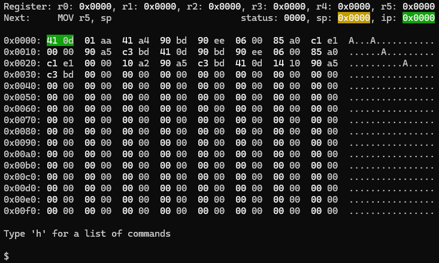

# YaRISC DIY processor
Yet Another RISC is a side project to learn. That's it 😊 In particular this architecture doesn't want to be relevant, useful, or fast.

## Goal
Maybe one day I would like to build a real hardware design. Therefore, one goal of this architecture is to be reasonably small. Software first (emulator and compiler) allows to explore the design space faster and cheaper.

## Emulator
Use Conan and CMake in this root directory to build the emulator and tests.



## Compiler
The llvm sub directory contains a patch for the [llvm-project](https://github.com/llvm/llvm-project) that adds the YaRISC backend. Apply the patch and build "YaRISC" as an experimental backend.

```asm
	.globl	baz                             # -- Begin function baz
	.p2align	1
	.type	baz,@function
baz:                                    # @baz
# %bb.0:                                # %entry
	MOV r5, sp
	MOV r0, 5
	MOV r1, 2
	ADD sp, sp, -2
	ADD r2, ip, 6
	STX r2, [sp, 0]
	MOV ip, %16(bar)
	ADD sp, sp, 2
	LDX ip, [sp, -2]
.Lfunc_end0:
	.size	baz, .Lfunc_end0-baz
                                        # -- End function
	.globl	bar                             # -- Begin function bar
	.p2align	1
	.type	bar,@function
bar:                                    # @bar
# %bb.0:                                # %entry
	MOV r5, sp
	ADD sp, sp, -2
	ADD r2, ip, 6
	STX r2, [sp, 0]
	MOV ip, %16(foo)
	ADD r0, r0, 1
	ADD sp, sp, 2
	LDX ip, [sp, -2]
.Lfunc_end1:
	.size	bar, .Lfunc_end1-bar
                                        # -- End function
	.globl	foo                             # -- Begin function foo
	.p2align	1
	.type	foo,@function
foo:                                    # @foo
# %bb.0:                                # %entry
	MOV r5, sp
	SUB r0, r0, r1
	ADD sp, sp, 2
	LDX ip, [sp, -2]
.Lfunc_end2:
	.size	foo, .Lfunc_end2-foo
                                        # -- End function
```